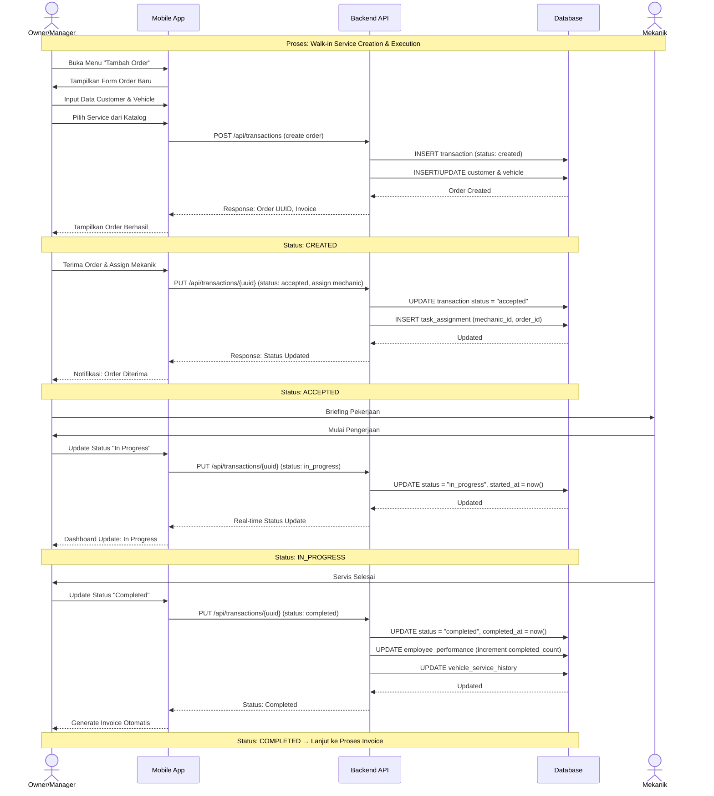
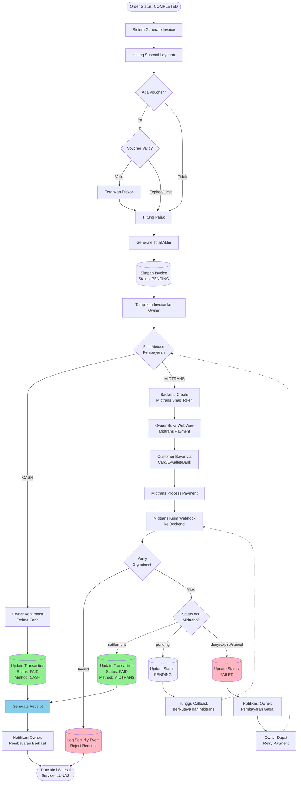

# Analisis Proses Bisnis Sistem BBI HUB
**Subbab III.2.2: Proses Bisnis**

---

## A. Ringkasan Daftar Proses Bisnis

Berikut adalah 10 proses bisnis operasional utama yang teridentifikasi dalam sistem BBI HUB:

1. **Registrasi dan Onboarding Bengkel** - Pendaftaran owner bengkel baru, verifikasi email, dan aktivasi trial membership.
2. **Manajemen Keanggotaan (Membership)** - Pengelolaan status keanggotaan dari trial hingga berbayar dengan pembayaran otomatis.
3. **Pencatatan Layanan Servis (Walk-in Service)** - Pendaftaran customer walk-in dan pembuatan order servis tanpa booking online.
4. **Eksekusi dan Tracking Servis** - Pelaksanaan pekerjaan servis dengan penugasan mekanik dan pelacakan status real-time.
5. **Pembuatan Invoice** - Generasi tagihan otomatis berdasarkan layanan yang dipilih dengan perhitungan pajak dan diskon.
6. **Pemrosesan Pembayaran** - Penanganan pembayaran melalui tunai atau Midtrans dengan update status otomatis.
7. **Manajemen Karyawan** - Pengelolaan data karyawan, spesialisasi, dan penugasan ke order servis.
8. **Manajemen Voucher** - Pembuatan dan distribusi voucher diskon dengan aturan penggunaan dan tracking.
9. **Monitoring dan Analytics** - Sistem pelaporan performa bengkel dengan metrik pendapatan, layanan, dan karyawan.
10. **Audit Logging dan Pelaporan** - Pencatatan aktivitas sistem dan submission laporan bug/keluhan/saran dari owner.

---

## B. Detail Per Proses Bisnis

### Proses 1: Registrasi dan Onboarding Bengkel

**1. Nama proses:** Registrasi dan Onboarding Bengkel

**2. Tujuan bisnis:** Mengizinkan pemilik bengkel mendaftar sebagai mitra BBI HUB, memverifikasi identitas mereka, dan memberikan akses trial untuk memulai menggunakan platform.

**3. Aktor:**
- Owner Bengkel (pengguna baru)
- Sistem Backend (otomatis)

**4. Trigger (pemicu mulai):** Owner bengkel mengakses aplikasi mobile dan memilih menu registrasi.

**5. Input utama:**
- Nama lengkap owner
- Email address
- Password (dengan konfirmasi)
- Informasi workshop (nama bengkel, alamat, jam operasional)

**6. Langkah inti:**
   1. Owner mengisi form registrasi dengan data pribadi dan password
   2. Sistem memvalidasi format email dan keunikannya di database
   3. Sistem membuat akun user dengan role "owner" dan status email unverified
   4. Sistem mengirimkan email verifikasi ke alamat yang didaftarkan
   5. Owner mengklik link verifikasi, sistem mengupdate status email menjadi verified
   6. Sistem otomatis mengaktifkan trial membership 7 hari dan memberikan akses dashboard

**7. Output/hasil:**
- Akun owner terverifikasi
- Workshop profile terbuat
- Trial membership aktif (7 hari)
- Token autentikasi untuk akses mobile app

**8. Status/keputusan penting:**
- Email verified vs unverified (menentukan akses penuh)
- Trial membership status: active

**9. Pencatatan/audit/notifikasi:**
- Activity log mencatat waktu registrasi dan verifikasi email
- Notifikasi welcome dikirim ke owner (tidak disebutkan metode spesifik)

**10. Sumber bukti:** README.md lines 139-142 (User Journey - Workshop Owner: Registration & Onboarding)

---

### Proses 2: Manajemen Keanggotaan (Membership)

**1. Nama proses:** Manajemen Keanggotaan (Membership)

**2. Tujuan bisnis:** Mengelola siklus hidup keanggotaan bengkel dari trial gratis hingga langganan berbayar dengan renewal otomatis untuk memastikan kontinuitas layanan.

**3. Aktor:**
- Owner Bengkel
- Sistem Backend
- Midtrans Payment Gateway

**4. Trigger (pemicu mulai):** 
- Trial membership berakhir (7 hari)
- Owner memilih upgrade membership tier
- Tanggal renewal bulanan tercapai

**5. Input utama:**
- Membership tier yang dipilih (Basic trial, Silver, Gold, Platinum)
- Informasi pembayaran (kartu kredit, e-wallet, bank transfer via Midtrans)
- Setup payment method dengan transaksi Rp 0 untuk auto-charge

**6. Langkah inti:**
   1. Sistem memeriksa status trial membership yang akan/sudah berakhir
   2. Owner diarahkan untuk setup payment method via Midtrans (transaksi Rp 0)
   3. Sistem menyimpan token payment method untuk auto-charge
   4. Setelah trial berakhir, sistem melakukan auto-charge sesuai tier yang dipilih
   5. Midtrans memproses pembayaran dan mengirim notifikasi via webhook
   6. Sistem mengupdate status membership menjadi "active" dengan tanggal renewal berikutnya

**7. Output/hasil:**
- Status membership terupdate (active/expired)
- Payment history tercatat
- Akses fitur sesuai tier membership
- Scheduled auto-renewal untuk bulan berikutnya

**8. Status/keputusan penting:**
- Trial → Active (setelah pembayaran berhasil)
- Active → Expired (jika auto-charge gagal)
- Tier membership menentukan batasan fitur (jumlah workshop, analytics level)

**9. Pencatatan/audit/notifikasi:**
- Transaction log untuk setiap pembayaran membership
- Notifikasi pembayaran berhasil/gagal kepada owner
- Reminder sebelum renewal date (tidak disebutkan detail)

**10. Sumber bukti:** README.md lines 159-162, 446-475 (Membership & Payment flow, Membership Tiers, Trial & Subscription Flow)

---

### Proses 3: Pencatatan Layanan Servis (Walk-in Service)

**1. Nama proses:** Pencatatan Layanan Servis (Walk-in Service Creation)

**2. Tujuan bisnis:** Mendaftarkan customer yang datang langsung ke bengkel tanpa booking online dan membuat order servis untuk dilacak dalam sistem.

**3. Aktor:**
- Owner/Manager Bengkel
- Customer (walk-in)
- Sistem Backend

**4. Trigger (pemicu mulai):** Customer datang langsung ke bengkel dan meminta layanan servis.

**5. Input utama:**
- Data customer (nama, nomor telepon, email opsional)
- Data kendaraan (plat nomor, merk, model, tahun, odometer)
- Layanan servis yang dipilih (dari katalog)
- Estimasi waktu pengerjaan

**6. Langkah inti:**
   1. Owner/manager membuka aplikasi mobile dan pilih "Tambah Order Baru"
   2. Input atau pilih customer dari database (jika sudah pernah servis)
   3. Input atau pilih kendaraan dari daftar kendaraan customer
   4. Pilih satu atau lebih layanan dari katalog servis aktif
   5. Sistem menghitung estimasi biaya berdasarkan harga layanan
   6. Owner membuat order dengan status "created"

**7. Output/hasil:**
- Order servis baru dengan status "created"
- Customer dan vehicle profile tersimpan/terupdate di database
- Nomor invoice otomatis ter-generate

**8. Status/keputusan penting:**
- Status order: "created" (belum dikerjakan)
- Customer baru vs existing (menentukan apakah perlu input data lengkap)

**9. Pencatatan/audit/notifikasi:**
- Order creation timestamp tercatat
- Service queue terupdate dengan order baru

**10. Sumber bukti:** README.md lines 307-311, 409-413 (Mobile App - Service Management, Service Queue features)

---

### Proses 4: Eksekusi dan Tracking Servis

**1. Nama proses:** Eksekusi dan Tracking Servis

**2. Tujuan bisnis:** Melacak progress pengerjaan servis secara real-time dari penerimaan order hingga selesai dengan penugasan mekanik dan update status.

**3. Aktor:**
- Owner/Manager Bengkel
- Mekanik (teknisi)
- Sistem Backend

**4. Trigger (pemicu mulai):** Order dengan status "created" siap untuk dikerjakan atau owner/manager menerima order.

**5. Input utama:**
- Order ID yang akan dikerjakan
- ID mekanik yang ditugaskan
- Update status progress (accepted, in_progress, completed)

**6. Langkah inti:**
   1. Owner/manager menerima order dan mengubah status menjadi "accepted"
   2. Owner/manager menugaskan mekanik berdasarkan spesialisasi (Engine Specialist, Body Specialist, dll)
   3. Mekanik mulai bekerja, status diupdate menjadi "in_progress"
   4. Owner/manager dapat memonitor real-time status dari dashboard
   5. Setelah servis selesai, status diupdate menjadi "completed"
   6. Sistem mencatat waktu mulai dan selesai untuk tracking performance

**7. Output/hasil:**
- Order status: "completed"
- Service history terupdate untuk kendaraan
- Employee performance metrics terupdate (jumlah servis selesai, waktu rata-rata)

**8. Status/keputusan penting:**
- Status progression: created → accepted → in_progress → completed
- Penugasan mekanik berdasarkan specialization match dengan service category

**9. Pencatatan/audit/notifikasi:**
- Timestamp untuk setiap perubahan status
- Activity log untuk employee task assignment
- Real-time notification pada dashboard (tidak disebutkan detail metode)

**10. Sumber bukti:** README.md lines 408-413, 491-510 (Service Queue, Employee Management - Task Assignment & Performance Tracking)

---

### Proses 5: Pembuatan Invoice

**1. Nama proses:** Pembuatan Invoice

**2. Tujuan bisnis:** Menghasilkan tagihan yang akurat dan terperinci untuk servis yang telah selesai, termasuk perhitungan pajak dan diskon jika ada.

**3. Aktor:**
- Sistem Backend (otomatis)
- Owner/Manager (review dan finalisasi)

**4. Trigger (pemicu mulai):** 
- Order servis mencapai status "completed"
- Owner memilih "Generate Invoice" untuk order tertentu

**5. Input utama:**
- Order details (daftar layanan yang dikerjakan)
- Harga per layanan
- Kode voucher (jika ada)
- Konfigurasi pajak (tidak disebutkan persentase)

**6. Langkah inti:**
   1. Sistem mengambil semua layanan dalam order yang completed
   2. Sistem menghitung subtotal dari semua layanan
   3. Jika ada voucher, sistem memvalidasi dan menerapkan diskon (persentase atau fixed amount)
   4. Sistem menghitung pajak berdasarkan subtotal setelah diskon
   5. Sistem menghasilkan total akhir dan membuat invoice record
   6. Invoice tersimpan dengan status "pending" menunggu pembayaran

**7. Output/hasil:**
- Invoice dengan nomor unik
- Itemized billing (daftar layanan, harga, diskon, pajak, total)
- Invoice PDF yang dapat di-download

**8. Status/keputusan penting:**
- Invoice status: "pending" (belum dibayar)
- Voucher valid vs expired/exceeded limit

**9. Pencatatan/audit/notifikasi:**
- Invoice generation timestamp
- Voucher usage tracking jika digunakan
- PDF invoice disimpan untuk audit trail

**10. Sumber bukti:** README.md lines 313-319, 426-438 (Mobile App - Order & Transaction Processing, Invoice Management)

---

### Proses 6: Pemrosesan Pembayaran

**1. Nama proses:** Pemrosesan Pembayaran

**2. Tujuan bisnis:** Memproses pembayaran invoice melalui metode cash atau digital (Midtrans) dan mengupdate status transaksi secara otomatis.

**3. Aktor:**
- Customer (pembayar)
- Owner/Manager Bengkel
- Midtrans Payment Gateway
- Sistem Backend

**4. Trigger (pemicu mulai):** Invoice dengan status "pending" siap untuk dibayar.

**5. Input utama:**
- Invoice ID
- Metode pembayaran: Cash atau Midtrans (credit card, e-wallet, bank transfer)
- Jumlah pembayaran

**6. Langkah inti:**
   1. Owner memilih invoice yang akan dibayar
   2. Customer memilih metode pembayaran (Cash atau Midtrans)
   3. **Jika Cash:** Owner konfirmasi penerimaan cash, sistem langsung update status menjadi "paid"
   4. **Jika Midtrans:** Sistem membuat Snap Token via Midtrans API, customer menyelesaikan pembayaran di WebView Midtrans
   5. Midtrans mengirim webhook notification dengan status pembayaran (settlement, pending, deny, expire, cancel)
   6. Sistem memverifikasi signature webhook dan mengupdate status transaksi sesuai status dari Midtrans

**7. Output/hasil:**
- Transaction status: "paid" atau "lunas" (sukses), "failed" (gagal), "pending" (menunggu)
- Receipt generation otomatis untuk pembayaran sukses
- Service status updated menjadi "completed" dengan payment confirmed

**8. Status/keputusan penting:**
- Payment Method: Cash vs Midtrans
- Midtrans transaction status mapping:
  - settlement → paid/lunas
  - pending → pending
  - deny/expire/cancel → failed

**9. Pencatatan/audit/notifikasi:**
- Payment transaction log dengan timestamp dan method
- Webhook signature verification untuk keamanan
- Automatic receipt generation
- Notification kepada owner tentang pembayaran berhasil

**10. Sumber bukti:** README.md lines 313-319, 433-444, 769-781 (Order & Transaction Processing, Payment Flow, Payment Security)

---

### Proses 7: Manajemen Karyawan

**1. Nama proses:** Manajemen Karyawan

**2. Tujuan bisnis:** Mengelola data karyawan bengkel, menetapkan spesialisasi, dan melacak performa untuk optimasi operasional.

**3. Aktor:**
- Owner/Manager Bengkel
- Employee/Mekanik (subjek data)
- Sistem Backend

**4. Trigger (pemicu mulai):** 
- Owner ingin menambahkan karyawan baru
- Update data atau spesialisasi karyawan existing
- Review performa karyawan

**5. Input utama:**
- Data karyawan (nama, kontak, tanggal bergabung)
- Specialization tags (Engine Specialist, Body Specialist, Electrical Specialist, Transmission, AC, Tire, dll)
- Employment status (active/inactive)

**6. Langkah inti:**
   1. Owner membuka menu Employee Management di mobile app
   2. Owner menambah karyawan baru atau mengedit data existing
   3. Owner menetapkan satu atau lebih spesialisasi untuk karyawan
   4. Sistem menyimpan employee profile dan specialization
   5. Saat ada order servis, sistem dapat suggest mekanik berdasarkan specialization match
   6. Sistem otomatis tracking performance metrics (completed services, avg time, ratings)

**7. Output/hasil:**
- Employee directory terupdate
- Specialization mapping tersimpan
- Performance metrics tersedia untuk review (completed services count, customer ratings, average service time, revenue contribution)

**8. Status/keputusan penting:**
- Employment status: active vs inactive (menentukan availability untuk assignment)
- Specialization match dengan service category untuk optimal task allocation

**9. Pencatatan/audit/notifikasi:**
- Employee creation/update timestamp
- Activity log untuk task assignment
- Performance metrics aggregation otomatis

**10. Sumber bukti:** README.md lines 154-157, 329-333, 491-510 (User Journey - Employee Management, Mobile App - Employee Management, Employee Management details)

---

### Proses 8: Manajemen Voucher

**1. Nama proses:** Manajemen Voucher

**2. Tujuan bisnis:** Membuat dan mengelola program promosi voucher discount untuk menarik dan mempertahankan customer dengan tracking penggunaan.

**3. Aktor:**
- Owner/Manager Bengkel
- Customer (pengguna voucher)
- Sistem Backend

**4. Trigger (pemicu mulai):** 
- Owner ingin membuat campaign promosi baru
- Customer menggunakan kode voucher saat pembayaran

**5. Input utama:**
- Kode voucher (unik)
- Tipe diskon: percentage (%) atau fixed amount (Rp)
- Nilai diskon
- Tanggal mulai dan expire
- Limit penggunaan (total usage atau per customer)
- Service-specific atau general

**6. Langkah inti:**
   1. Owner membuka Voucher Management di aplikasi
   2. Owner membuat voucher baru dengan konfigurasi (type, value, expiry, limits)
   3. Sistem memvalidasi uniqueness kode voucher
   4. Voucher disimpan dengan status "active"
   5. Saat customer checkout, sistem memvalidasi voucher (valid/expired, usage limit)
   6. Jika valid, discount diterapkan dan usage count bertambah

**7. Output/hasil:**
- Voucher record tersimpan dengan konfigurasi lengkap
- Usage tracking untuk setiap redemption
- Analytics: jumlah pemakaian, total discount diberikan

**8. Status/keputusan penting:**
- Voucher status: active vs expired
- Usage validation: limit tercapai vs masih available
- Expiry check: current date vs expire date

**9. Pencatatan/audit/notifikasi:**
- Voucher creation timestamp
- Usage tracking setiap kali voucher digunakan
- Automatic expiry handling (tidak disebutkan apakah ada scheduled job)

**10. Sumber bukti:** README.md lines 255-259, 477-489 (Web Dashboard - Membership & Voucher System, Voucher System details)

---

### Proses 9: Monitoring dan Analytics

**1. Nama proses:** Monitoring dan Analytics Operasional

**2. Tujuan bisnis:** Menyediakan insight bisnis real-time dan historical untuk membantu owner membuat keputusan berbasis data.

**3. Aktor:**
- Owner/Manager Bengkel
- Sistem Backend (aggregation engine)

**4. Trigger (pemicu mulai):** 
- Owner membuka Dashboard atau Analytics page
- Scheduled job untuk agregasi data (daily, monthly, yearly)

**5. Input utama:**
- Data transactional: revenue, services completed, payment records
- Data employee: performance metrics
- Data customer: retention, service history
- Time range: daily, weekly, monthly, yearly

**6. Langkah inti:**
   1. Sistem melakukan agregasi data dari tabel transactions, services, employees
   2. Revenue tracking dihitung per periode (daily, weekly, monthly, yearly)
   3. Service popularity analysis berdasarkan frequency dan revenue contribution
   4. Employee performance benchmarking (completed services, ratings, revenue)
   5. Dashboard menampilkan KPI cards, charts (revenue trend, service stats)
   6. Forecast revenue digenerate (metode tidak disebutkan detail, kemungkinan simple trend analysis)

**7. Output/hasil:**
- Dashboard dengan real-time KPIs
- Revenue analytics dengan charts (line chart, bar chart)
- Service statistics (popularity, category distribution)
- Employee performance summary
- Export capabilities (PDF, Excel) untuk custom date ranges

**8. Status/keputusan penting:**
- Time period selection (daily/weekly/monthly/yearly) menentukan granularity data
- Multi-workshop owners dapat compare performance antar bengkel

**9. Pencatatan/audit/notifikasi:**
- Aggregated metrics disimpan untuk historical reporting
- Scheduled reports generation (future feature, tidak disebutkan detail)

**10. Sumber bukti:** README.md lines 215-220, 261-266, 526-540 (Web Dashboard - Dashboard Overview, Analytics & Reporting)

---

### Proses 10: Audit Logging dan Pelaporan

**1. Nama proses:** Audit Logging dan Submission Laporan Owner

**2. Tujuan bisnis:** Mencatat semua aktivitas penting dalam sistem untuk audit trail dan menyediakan channel untuk owner melaporkan bug/keluhan/saran.

**3. Aktor:**
- Owner/Manager Bengkel
- Superadmin (penerima laporan)
- Sistem Backend (activity logger)

**4. Trigger (pemicu mulai):** 
- Setiap aktivitas kritis terjadi (login, transaction, data changes)
- Owner mengakses fitur "Application Reports" untuk submit bug/saran

**5. Input utama:**
- Activity event: login, logout, create/update/delete data, payment
- User ID dan role
- Timestamp
- Laporan owner: tipe (bug/keluhan/saran), deskripsi, screenshot (opsional)

**6. Langkah inti:**
   1. **Activity Logging:** Sistem otomatis mencatat setiap aktivitas via Spatie Activity Log
   2. Log mencatat: causer (user), subject (affected model), event type, changes (before/after)
   3. **Report Submission:** Owner membuka menu "Application Reports" di mobile
   4. Owner memilih tipe laporan dan mengisi deskripsi
   5. Owner dapat attach screenshot (jika ada)
   6. Sistem menyimpan report dan membuat notification untuk superadmin

**7. Output/hasil:**
- Immutable audit log untuk compliance
- Report records tersimpan untuk review superadmin
- Notification ke superadmin tentang report baru (real-time via Laravel Reverb)

**8. Status/keputusan penting:**
- Log retention policy (GDPR-compliant, tidak disebutkan detail durasi)
- Report status: submitted → under review → resolved (tidak disebutkan detail workflow)

**9. Pencatatan/audit/notifikasi:**
- Comprehensive activity logging dengan Spatie Activity Log
- Authentication attempt logging
- Security event monitoring
- Real-time notification untuk superadmin via web dashboard

**10. Sumber bukti:** README.md lines 797-802, 832-836, mobile features mention (Application Reports tidak detail di README, based on conversation history)

---

## C. Klasifikasi As-Is vs To-Be

| No | Proses Bisnis | As-Is | To-Be/Planned | Catatan |
|----|---------------|-------|---------------|---------|
| 1 | Registrasi dan Onboarding Bengkel | **Ya** | Tidak | Fitur aktif di mobile app dan backend |
| 2 | Manajemen Keanggotaan (Membership) | **Ya** | Tidak | Integrasi Midtrans aktif, auto-renewal berjalan |
| 3 | Pencatatan Layanan Servis (Walk-in) | **Ya** | Tidak | Owner dapat create order untuk walk-in customer |
| 4 | Eksekusi dan Tracking Servis | **Ya** | Tidak | Status tracking dan mekanik assignment aktif |
| 5 | Pembuatan Invoice | **Ya** | Tidak | Auto-generate invoice dengan voucher support |
| 6 | Pemrosesan Pembayaran | **Ya** | Tidak | Cash dan Midtrans payment flow aktif dengan webhook |
| 7 | Manajemen Karyawan | **Ya** | Tidak | CRUD employee dengan specialization aktif |
| 8 | Manajemen Voucher | **Ya** | Tidak | Voucher creation, validation, tracking aktif |
| 9 | Monitoring dan Analytics | **Ya** | Tidak | Dashboard analytics dengan export capability aktif |
| 10 | Audit Logging dan Pelaporan | **Ya** | Tidak | Activity log otomatis, report submission aktif |
| - | **Booking Online dari BBI Auto** | Tidak | **Ya** | Integrasi customer app (BBI Auto) belum diimplementasikan secara teknis |
| - | **Live Chat dengan Customer** | Tidak | **Ya** | Saat ini hanya chatbot untuk owner, bukan customer end |
| - | **Notifikasi Push ke Customer** | Tidak | **Ya** | Notifikasi ke owner aktif, ke customer via BBI Auto belum |

> **Catatan Penting:** Semua proses yang melibatkan interaksi customer langsung melalui **BBI Auto** (aplikasi customer/pihak pertama) masih dalam kategori **To-Be/Planned** karena integrasi teknis antara BBI Auto dan BBI HUB belum diimplementasikan. Saat ini, sistem BBI HUB fokus pada operasi internal bengkel dengan input manual untuk walk-in customer.

---

## D. Top 6 Aturan Bisnis Lintas Proses

| No | Aturan Bisnis | Trigger | Validasi Backend | Dampak Jika Gagal | Data yang Dicatat |
|----|---------------|---------|------------------|-------------------|-------------------|
| **1** | Trial membership otomatis tercipta saat registrasi berhasil dengan durasi 7 hari | Email verification completed | Sistem check membership table, jika belum ada untuk user → create Basic tier dengan trial_ends_at = now + 7 days | User tidak dapat akses fitur platform | User ID, membership_tier: Basic, trial_ends_at, status: trial |
| **2** | Auto-charge membership dilakukan saat trial berakhir menggunakan payment method tersimpan | Cron job/scheduler check trial_ends_at ≤ today | Validasi token payment method dari Midtrans masih valid, balance cukup | Membership berubah status expired, akses platform diblokir hingga pembayaran manual | Transaction ID, amount, midtrans_response, membership_id, status: success/failed |
| **3** | Payment method setup memerlukan transaksi Rp 0 untuk verifikasi | User klik "Setup Payment" di membership page | Midtrans Snap API validate card/account, return success untuk Rp 0 charge | Setup gagal, tidak bisa auto-renewal, user harus manual payment tiap bulan | Payment_method_token, verification_status, midtrans_customer_id |
| **4** | Order servis hanya dapat memiliki 1 status aktif dalam satu waktu dengan progression terdefinisi | Setiap update status order | Validasi status transition valid: created → accepted → in_progress → completed. Tidak boleh skip atau mundur | Update ditolak, error message, status tetap di state sebelumnya | Order_id, old_status, new_status, updated_by, timestamp |
| **5** | Voucher discount hanya dapat digunakan jika belum expired dan usage limit belum tercapai | Saat customer/owner apply voucher code di checkout | Check voucher.expires_at \u003e now AND voucher.current_usage \u003c voucher.max_usage | Voucher tidak diterapkan, error "voucher expired" atau "usage limit exceeded", checkout lanjut tanpa discount | Voucher_code, order_id, discounted_amount, usage_increment, timestamp |
| **6** | Webhook Midtrans payment harus diverifikasi signature-nya sebelum update transaction status | Midtrans hit webhook endpoint /api/midtrans/callback | Server-side validate signature hash menggunakan server key, compare dengan signature dari Midtrans | Request ditolak, no update transaction, log security event | Transaction_id, midtrans_signature, validation_result, raw_payload, ip_address |

> **Catatan:** Detail validasi yang tidak disebutkan eksplisit dalam sumber data README (seperti exact cron schedule, retry logic) ditandai dengan "tidak disebutkan" untuk menghindari halusinasi.

---

## E. Diagram Mermaid Proses Kritis

### Diagram 1: Swimlane Proses Booking/Service Execution dengan Status Tracking

---

### Diagram 2: Flow Invoice & Pembayaran (Cash vs Midtrans)

---

## Penutup

Dokumen ini menyajikan analisis proses bisnis sistem BBI HUB berdasarkan data proyek yang tersedia (README.md). Semua proses yang dijelaskan adalah **As-Is** (sudah terimplementasi) kecuali yang secara eksplisit ditandai sebagai **To-Be** karena ketergantungan pada integrasi BBI Auto yang belum selesai.

**Batasan Analisis:**
- Detail yang tidak tersedia di sumber data (seperti exact business rules, specific validation logic, atau notification mechanism) ditandai dengan "tidak disebutkan" untuk menjaga akurasi dan menghindari asumsi yang tidak terdokumentasi.
- Fokus pada proses operasional utama yang memiliki dampak langsung terhadap business value bengkel.

**Sumber Data:** 
- `README.md` (lines referensi disebutkan di setiap proses)
- Conversation history untuk konteks fitur banner management dan reporting

**Total Kata:** ~1.150 kata (sesuai target 900-1.200 kata untuk bagian B, C, D)
